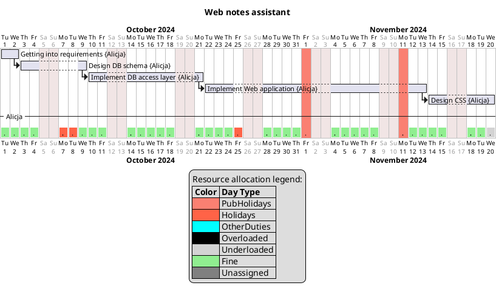

# planner
A simple tool for project planning and drawing Gantt charts.

One of the most challenging aspects of project management is accurately translating project estimates into a real-world timeline. This task is far from straightforward, as it requires accounting for numerous variables, such as weekends, holidays, public holidays, team members' other commitments, focus levels, task dependencies, and more. A common, but overly simplistic, approach is to treat estimates in isolation. For example, if a project is estimated to take 17 man-days, one might assume it will be completed in roughly three and a half weeks (based on a five-day workweek). Starting on October 1st, you'd expect the project to wrap up by October 24th. However, this assumption rarely holds up in practice. Below, we illustrate the more realistic calculations. 



As you can see, the project actually finishes at the end of November, far beyond our initial estimate. Mistakes like this are surprisingly common and often lead to confusion, misalignment, and unnecessary tension within teams.

The planner takes a [project definition](./examples/simple_project.toml) as input, with a self-explanatory format. In this definition, we specify the team members involved, the tasks with their respective dependencies, and the task assignments. Based on this information, the planner performs all the necessary calculations and generates a Gantt chart, accurately reflecting the timeline.

Here you can see a bit more complex scenario defined [here](./examples/complex_project.toml):


### Focus factor
In project definitions you will see so called `focus_factor`.

A focus factor is a parameter that helps bridge the gap between ideal project estimates and real-world conditions. It represents the proportion of a working day that can be effectively dedicated to productive development work. For example, if the focus factor is set to 0.5, this means that only 50% of the workday—typically 4 hours out of an 8-hour day—can be used for actual development. The remaining time is absorbed by non-development activities such as meetings, context switching, or other distractions.

The focus factor can also be used to model employee efficiency. A focus factor of 1.0 indicates that a developer can work at full capacity and complete tasks in alignment with the ideal estimate. On the other hand, a lower focus factor, such as 0.7 or 0.8, simulates reduced efficiency due to distractions or other commitments, meaning the task will take longer than the ideal estimate predicts.

This parameter is crucial for creating more realistic timelines and better managing expectations in project planning.

It's important to note that the focus factor should be experimentally determined, as it may vary significantly from employee to employee based on their working style, role, and the specific demands of the project. You can start from values like 0.6 or 0.7 and adjust them according to the feedback.

## Dependencies
Project is written in Rust, you need to have a Rust development environment.
### Plantuml
The planner relies on the plantuml library, an opensource tool for drawing different kind of diagram, including Gantt charts.
Install plantuml first:
- install JRE, e.g. on Ubuntu:
```
sudo apt install default-jre
```
- download th plantuml jar library

## Build and install
Build the project
```
cargo build
```
